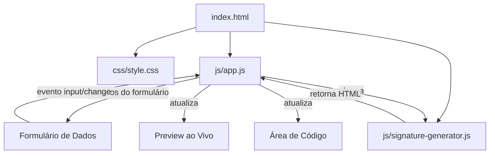

# Documento de Design: Email Signature Manager

## Visão Geral

O Email Signature Manager é uma ferramenta web frontend estática que permite aos membros da equipe DOit gerar assinaturas de e-mail em HTML. A aplicação consiste em um formulário de entrada de dados, um preview ao vivo da assinatura e uma área de código com funcionalidade de cópia.

A arquitetura é intencionalmente simples: HTML + CSS + JavaScript vanilla, sem frameworks, sem build tools, sem dependências externas. O HTML gerado para a assinatura utiliza exclusivamente estilos inline e layout de tabela para garantir compatibilidade com clientes de e-mail (Gmail, Outlook, Apple Mail, etc.).

### Decisões de Design Principais

1. **Layout de tabela para a assinatura**: Clientes de e-mail têm suporte limitado a CSS. Tabelas com estilos inline são o padrão da indústria para garantir renderização consistente.
2. **Duas colunas**: Coluna esquerda (~225px) para foto/nome/cargo, coluna direita para links de contato — mantendo o layout visual dos templates originais.
3. **Separação de responsabilidades**: A lógica de geração de HTML da assinatura fica isolada em um módulo próprio (`signature-generator.js`), separada da lógica de UI (`app.js`).
4. **Sem estado persistente**: Todos os dados vivem apenas na sessão atual do navegador. Não há localStorage nem cookies.

## Arquitetura



### Estrutura de Arquivos

```
├── index.html                    # Página principal com formulário, preview e área de código
├── css/
│   └── style.css                 # Estilos da interface da ferramenta
├── js/
│   ├── app.js                    # Lógica principal: eventos, validação, atualização de UI
│   └── signature-generator.js    # Módulo de geração do HTML da assinatura
└── assinaturas/
    └── HTML/
        ├── Brasil.html           # Template de referência Brasil
        └── USA.html              # Template de referência USA
```

### Fluxo de Dados

1. Usuário preenche/altera campos no formulário
2. Evento `input` ou `change` dispara handler em `app.js`
3. `app.js` coleta todos os valores do formulário e valida
4. `app.js` chama `generateSignature(data)` de `signature-generator.js`
5. O HTML retornado é inserido no preview (como HTML renderizado) e na área de código (como texto)

## Componentes e Interfaces

### 1. index.html — Estrutura da Página

A página é dividida em três seções principais:

| Seção | Descrição |
|-------|-----------|
| Formulário | Campos de entrada para dados da assinatura |
| Preview | Renderização visual da assinatura gerada |
| Código | Exibição do HTML gerado + botão de cópia |

**Campos do formulário:**
- Seletor de região (select): "Brasil" / "USA"
- Nome (text input)
- Cargo (text input)
- URL da foto (text input, placeholder com https://)
- E-mail (email input)
- Telefone (tel input)
- Instagram (text input, pré-preenchido pela região)
- Website (text input, pré-preenchido pela região)

### 2. js/app.js — Controlador Principal

```javascript
// Interface pública
function init()                    // Inicializa eventos e estado inicial
function handleRegionChange(region) // Atualiza campos padrão por região
function handleFormInput()         // Handler para qualquer alteração no formulário
function updatePreview(html)       // Atualiza o preview ao vivo
function updateCodeDisplay(html)   // Atualiza a área de código
function copyToClipboard()         // Copia HTML para clipboard
function validateField(field)      // Valida campo individual
```

**Responsabilidades:**
- Registrar event listeners nos campos do formulário
- Coletar dados do formulário em um objeto estruturado
- Chamar o gerador de assinatura
- Atualizar preview e área de código
- Gerenciar validação de campos
- Implementar funcionalidade de cópia

### 3. js/signature-generator.js — Gerador de HTML

```javascript
// Interface pública
function generateSignature(data)       // Gera HTML completo da assinatura
function formatPhoneForWhatsApp(phone) // Formata telefone para URL do WhatsApp
```

**Parâmetros de `generateSignature(data)`:**
```javascript
{
  name: string,          // Nome da pessoa
  role: string,          // Cargo
  photoUrl: string,      // URL da foto (https://)
  email: string,         // Endereço de e-mail
  phone: string,         // Telefone no formato visual
  instagram: string,     // Handle do Instagram (sem @)
  website: string        // URL do website (sem https://)
}
```

**Retorno:** String contendo o HTML completo da assinatura com estilos inline.

### 4. css/style.css — Estilos da Interface

Estilos aplicados apenas à ferramenta (não à assinatura gerada):
- Layout responsivo do formulário
- Estilização do preview container
- Estilização da área de código (monospace, scroll)
- Botão de cópia e feedback visual
- Estados de validação (erro/sucesso)

## Modelos de Dados

### SignatureData (objeto JavaScript)

```javascript
/**
 * @typedef {Object} SignatureData
 * @property {string} name - Nome da pessoa (pode ser vazio)
 * @property {string} role - Cargo da pessoa (pode ser vazio)
 * @property {string} photoUrl - URL completa da foto (https://...) ou vazio
 * @property {string} email - Endereço de e-mail
 * @property {string} phone - Telefone no formato visual (ex: "(11) 91305-2222")
 * @property {string} instagram - Handle do Instagram sem @ (ex: "doitsistema")
 * @property {string} website - Domínio do website sem protocolo (ex: "www.doit.com.br")
 */
```

### RegionConfig (constantes)

```javascript
const REGION_DEFAULTS = {
  brasil: {
    instagram: "doitsistema",
    website: "www.doit.com.br"
  },
  usa: {
    instagram: "doit.systems",
    website: "www.doiterp.com"
  }
};
```

### Estrutura HTML da Assinatura Gerada

```html
<table border="0" cellpadding="0" cellspacing="0" style="...">
  <tbody>
    <tr>
      <!-- Coluna Esquerda: ~225px -->
      <td style="width: 225px; vertical-align: top; padding: 10px;">
        <!-- Foto (condicional) -->
        
        <!-- Nome (condicional, negrito) -->
        <p style="font-family: Arial, Helvetica, sans-serif; font-weight: bold; ...">
          {name}
        </p>
        <!-- Cargo (condicional) -->
        <p style="font-family: Arial, Helvetica, sans-serif; ...">
          {role}
        </p>
      </td>
      <!-- Coluna Direita: links de contato -->
      <td style="vertical-align: top; padding-top: 20px;">
        <div style="margin: 1px; font-size: 12px; font-family: Arial, Helvetica, sans-serif; line-height: 18px;">
          <a href="https://www.instagram.com/{instagram}/" target="_blank" 
             style="color: black; text-decoration: none;">{instagram}</a>
        </div>
        <div style="...">
          <a href="https://api.whatsapp.com/send/?phone={encoded}" target="_blank" 
             style="color: black; text-decoration: none">{phone_visual}</a>
        </div>
        <div style="...">
          <a href="mailto:{email}" target="_blank" 
             style="color: black; text-decoration: none">{email}</a>
        </div>
        <div style="...">
          <a href="https://{website}/" target="_blank" 
             style="color: black; text-decoration: none">{website}</a>
        </div>
      </td>
    </tr>
  </tbody>
</table>
```

### Regras de Formatação do Telefone para WhatsApp

| Entrada | Saída (href) |
|---------|------|
| `(11) 91305-2222` | `https://api.whatsapp.com/send/?phone=%2B5511913052222` |
| `+1 (305) 555-1234` | `https://api.whatsapp.com/send/?phone=%2B13055551234` |
| `11 98077 7217` | `https://api.whatsapp.com/send/?phone=%2B551198077217` |

**Lógica:**
1. Se o número começa com `+`, remover o `+` e todos os caracteres não numéricos → prefixar com `%2B`
2. Se o número NÃO começa com `+`, remover todos os caracteres não numéricos → prefixar com `%2B55` (código Brasil padrão)

## Propriedades de Corretude

*Uma propriedade é uma característica ou comportamento que deve ser verdadeiro em todas as execuções válidas de um sistema — essencialmente, uma declaração formal sobre o que o sistema deve fazer. Propriedades servem como ponte entre especificações legíveis por humanos e garantias de corretude verificáveis por máquina.*

### Propriedade 1: Renderização de nome e cargo

*Para qualquer* nome e cargo não vazios fornecidos como entrada, o HTML gerado SHALL conter o nome dentro de um elemento com `font-weight: bold` e o cargo como texto, ambos na coluna esquerda (primeiro `<td>`) da tabela, utilizando a fonte "Arial, Helvetica, sans-serif".

**Valida: Requisitos 2.2, 4.1, 4.2, 4.3, 4.4**

### Propriedade 2: Corretude do elemento de foto

*Para qualquer* URL de foto válida (iniciando com "https://") e qualquer nome, o HTML gerado SHALL conter um elemento `` cujo atributo `src` é exatamente a URL fornecida e cujo atributo `alt` contém o nome da pessoa.

**Valida: Requisitos 3.1, 3.2, 3.4**

### Propriedade 3: Formato dos links de contato

*Para qualquer* conjunto de dados de contato (instagram, telefone, email, website), o HTML gerado SHALL conter:
- Um link com href `https://www.instagram.com/{instagram}/`
- Um link com href `https://api.whatsapp.com/send/?phone={numero_codificado}`
- Um link com href `mailto:{email}`
- Um link com href `https://{website}/`

Todos com `target="_blank"`.

**Valida: Requisitos 5.4, 5.5, 5.6, 5.7**

### Propriedade 4: Codificação do telefone para WhatsApp

*Para qualquer* string de telefone composta por dígitos, parênteses, espaços e hífens (sem prefixo +), a função `formatPhoneForWhatsApp` SHALL retornar uma string que começa com `%2B55` seguida apenas dos dígitos extraídos do input. *Para qualquer* string de telefone iniciando com `+`, a função SHALL retornar `%2B` seguido apenas dos dígitos (sem adicionar 55).

**Valida: Requisitos 9.1, 9.3**

### Propriedade 5: Preservação visual do telefone

*Para qualquer* string de telefone fornecida como entrada, o texto visível do link de telefone no HTML gerado SHALL ser exatamente igual à string original digitada pelo usuário.

**Valida: Requisito 9.2**

### Propriedade 6: Invariante de estrutura de tabela e estilos inline

*Para qualquer* conjunto válido de dados de entrada, o HTML gerado SHALL:
- Conter uma `<table>` com atributos `border="0"`, `cellpadding="0"` e `cellspacing="0"`
- Ter exatamente dois elementos `<td>` (duas colunas)
- Não conter nenhum atributo `class` em nenhum elemento
- Ter todos os estilos aplicados via atributo `style` inline

**Valida: Requisitos 5.1, 5.2, 5.10**

### Propriedade 7: Estilização dos links de contato

*Para qualquer* HTML gerado com dados de contato, todos os elementos `<a>` na coluna direita SHALL ter o estilo inline contendo `color: black` e `text-decoration: none`, e cada div de contato SHALL ter `font-size: 12px`, `font-family: Arial, Helvetica, sans-serif` e `line-height: 18px`.

**Valida: Requisitos 5.8, 5.9**

### Propriedade 8: Validação de e-mail

*Para qualquer* string que contenha exatamente um `@` com texto antes e depois (incluindo um `.` após o `@`), a validação SHALL aceitar como válido. *Para qualquer* string sem `@` ou sem texto antes/depois do `@`, a validação SHALL rejeitar como inválido.

**Valida: Requisito 2.4**

### Propriedade 9: Validação de telefone

*Para qualquer* string composta exclusivamente por dígitos, parênteses, espaços, hífens e opcionalmente `+` no início, a validação SHALL aceitar como válido. *Para qualquer* string contendo letras ou outros caracteres especiais, a validação SHALL rejeitar como inválido.

**Valida: Requisito 2.5**

### Propriedade 10: Validação de URL da foto

*Para qualquer* string que inicia com "https://", a validação SHALL aceitar como válido. *Para qualquer* string que não inicia com "https://" (incluindo "http://"), a validação SHALL rejeitar como inválido.

**Valida: Requisito 2.6**

## Tratamento de Erros

### Campos Opcionais Vazios

| Campo Vazio | Comportamento |
|-------------|---------------|
| Nome | Elemento de nome omitido da assinatura |
| Cargo | Elemento de cargo omitido da assinatura |
| URL da foto | Elemento `` omitido da assinatura |
| E-mail | Link de e-mail omitido da coluna direita |
| Telefone | Link de WhatsApp omitido da coluna direita |
| Instagram | Link de Instagram omitido da coluna direita |
| Website | Link de website omitido da coluna direita |

### Validação de Campos

- **E-mail inválido**: Exibir mensagem de erro visual abaixo do campo, não bloquear a geração (gerar com o valor informado).
- **URL da foto inválida**: Exibir mensagem de erro visual, não incluir o `` na assinatura.
- **Telefone com caracteres inválidos**: Exibir mensagem de erro visual abaixo do campo.

### Fallback de Clipboard

Se `navigator.clipboard.writeText()` não estiver disponível (contexto não-seguro ou navegador antigo):
1. Criar um elemento `<textarea>` temporário
2. Inserir o HTML como texto
3. Selecionar todo o conteúdo (`select()`)
4. Tentar `document.execCommand('copy')` como fallback
5. Se falhar, manter o texto selecionado para cópia manual pelo usuário

### Caracteres Especiais no HTML

- Caracteres `<`, `>`, `&`, `"` nos dados do usuário (nome, cargo) devem ser escapados para entidades HTML (`&lt;`, `&gt;`, `&amp;`, `&quot;`) para evitar quebra da estrutura HTML.

## Estratégia de Testes

### Abordagem Dual

A estratégia de testes combina testes unitários baseados em exemplos com testes baseados em propriedades:

#### Testes Baseados em Propriedades (Property-Based Testing)

**Biblioteca**: [fast-check](https://github.com/dubzzz/fast-check) (JavaScript)

**Configuração**: Mínimo de 100 iterações por teste de propriedade.

**Tag format**: `Feature: email-signature-manager, Property {number}: {property_text}`

Cada propriedade de corretude definida acima será implementada como um teste de propriedade individual:

| Propriedade | Módulo Testado | Gerador de Dados |
|-------------|----------------|------------------|
| 1: Renderização nome/cargo | `signature-generator.js` | Strings arbitrárias não-vazias para nome e cargo |
| 2: Elemento de foto | `signature-generator.js` | URLs válidas (https://...) + nomes arbitrários |
| 3: Links de contato | `signature-generator.js` | Handles, emails, telefones e websites arbitrários |
| 4: Codificação WhatsApp | `signature-generator.js` | Strings de telefone com/sem prefixo + |
| 5: Preservação visual telefone | `signature-generator.js` | Strings de telefone arbitrárias |
| 6: Estrutura tabela/inline | `signature-generator.js` | Objetos SignatureData completos arbitrários |
| 7: Estilização links | `signature-generator.js` | Objetos SignatureData com dados de contato |
| 8: Validação e-mail | `app.js` | Strings arbitrárias (válidas e inválidas) |
| 9: Validação telefone | `app.js` | Strings arbitrárias (válidas e inválidas) |
| 10: Validação URL foto | `app.js` | Strings arbitrárias (válidas e inválidas) |

#### Testes Unitários (Baseados em Exemplos)

Focados em:
- Seleção de região e pré-preenchimento de campos (Requisito 1)
- Omissão condicional de elementos quando campos estão vazios (Requisitos 3.5, 4.5, 4.6)
- Funcionalidade de cópia para clipboard (Requisito 7.3)
- Feedback visual após cópia (Requisito 7.4)
- Fallback quando clipboard não disponível (Requisito 7.5)
- Atualização do preview em tempo real (Requisito 6.2)
- Escape de caracteres especiais HTML

#### Testes Manuais

- Compatibilidade visual em diferentes clientes de e-mail (Gmail, Outlook, Apple Mail)
- Responsividade da interface em diferentes tamanhos de tela
- Verificação de que links de WhatsApp abrem corretamente no aplicativo

### Estrutura de Testes

```
tests/
├── signature-generator.test.js   # Testes de propriedade + unitários do gerador
├── validation.test.js            # Testes de propriedade das funções de validação
└── app.test.js                   # Testes unitários da lógica de UI
```

### Execução

```bash
# Executar todos os testes
npx vitest --run

# Executar apenas testes de propriedade
npx vitest --run --grep "Property"
```

> **Nota**: O projeto não usa build tools para produção, mas `vitest` + `fast-check` são dependências de desenvolvimento para testes. A aplicação em si não depende deles.

